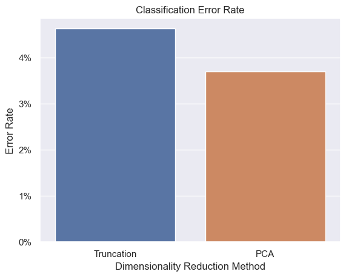
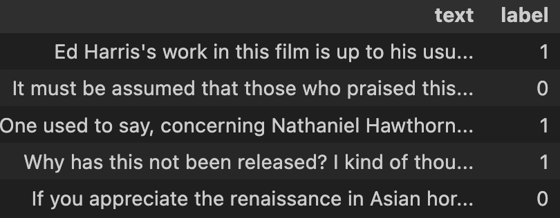
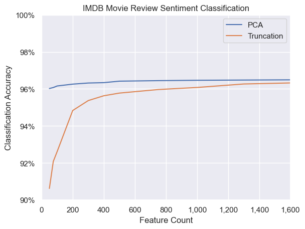

# Large Embeddings: Truncate or PCA?

This notebook compares two approaches to dimensionality reduction on outputs from OpenAI's `text-embedding-3-large` model. Truncation is simpler, but PCA can yield better results for certain downstream applications.

On the IMDB movie review classification dataset and with a reduced dimensionality of 300, PCA yields a 3.68% error rate, while truncation results in a 4.63% error rate.

 

### Background

OpenAI's model `text-embedding-3-large` takes advantage of [Matryoshka Representation Learning (MRL)](https://arxiv.org/abs/2205.13147), giving outputs the favorable property of denser information in the early parts of the vector, with less dense information in the later part of the vector. 

### Reducing Dimensionality

There are many benefits to reducing dimensionality of embeddings. Smaller vectors are much easier to store and faster/cheaper to use in downstream processes. 

### Truncation vs. Principal Component Analysis

Careful thought should be given to the approach for dimensionality reduction. 

Benefits of truncating embeddings upfront:
 - Simpler
 - No need to store the large embeddings
 - No need to post-process/PCA the embeddings
 - Easier to add new data over time

 Benefits of using full embeddings to perform PCA:
 - Preserve more variance specific to your dataset

In theory, we would expect the PCA approach to yield better results on tasks such as classification, due to the greater preserved variance. 

### Results

I used the IMDB review dataset, which contains review text and a corresponding label classifying sentiment as positive or negative.

 

To do the comparison, I followed these steps:

1. Calculated embeddings for each review
2. Reduced the dimensionality by truncating the vectors and also using PCA
3. Trained a logistic regression model on each reduced dimensionality 
4. Compared the results
5. Repeated steps 2-4 for different dimension counts

 

 

We can see that PCA results in more accurate classification, though the difference trends towards zero as we approach the full 3072 original dimensions. 

My takeaway is whenever possible, I'll keep the fully dimensionality embeddings and use post-processing/PCA pipelines to optimize speed/performance/cost when needed.
